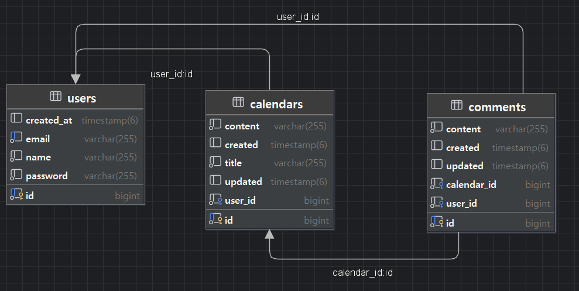

# 📅 Calendar with Spring JPA

- with : JAVA, Spring boot, JPA, PostgreSQL
- 구현된 기능 : 회원가입, 로그인, 로그아웃, 캘린더 crud, paging / 회원 crud / 댓글 crud, paging

## ⭐ ERD

## ⭐ API 명세서

### **Author 관련 API**

| **기능**       | **Method** | **URL**                           | **Request**         | **Response**      | **상태코드** |
|----------------|------------|-----------------------------------|---------------------|-------------------|--------------|
| Author 등록    | POST       | `/authors`                       | 등록 정보 Body      | 등록 정보         | 200: 등록    |
| Author 조회    | GET        | `/authors/{authorId}`            | Path Param          | Author 정보       | 200: 조회    |
| Author 수정    | POST       | `/authors/{authorId}/update`     | 수정 정보 Body      | 수정 정보         | 200: 수정    |
| Author 삭제    | POST       | `/authors/{authorId}/delete`     | Path Param + Body   | 삭제 완료         | 204: 삭제    |

---

### **Schedule 관련 API**

| **기능**       | **Method** | **URL**                             | **Request**             | **Response**      | **상태코드** |
|----------------|------------|-------------------------------------|-------------------------|-------------------|--------------|
| Schedule 등록  | POST       | `/schedules`                       | 등록 정보 Body          | 등록된 정보       | 200: 등록    |
| Schedule 조회  | GET        | `/schedules/{scheduleId}`          | Path Param              | Schedule 정보     | 200: 조회    |
| Schedule 수정  | POST       | `/schedules/{scheduleId}/update`   | 수정 정보 Body          | 수정된 정보       | 200: 수정    |
| Schedule 삭제  | POST       | `/schedules/{scheduleId}/delete`   | Path Param + Body       | 삭제 완료         | 204: 삭제    |

## 🌼 유지 보수가 편리한 스케줄러를 만들었습니다!
1. Layered Architecture 를 따르도록 리팩토링 했습니다.

2. SOLID 원칙을 최대한 생각하며, 새 코드를 추가할 때 불편함이 없도록 구현했습니다.

3. 클래스, 메서드 네이밍을 확실히 했습니다.

4. 예외 클래스에 추상화를 적용하고, 에러코드를 enum 으로 관리하며 확장성과 사용성을 높였습니다.

## 🎓 최대한 많이 배우려고 노력했습니다!
1. jpql, persistence context, filter/session 등 낯선 기능들을 공부하며 써보려 노력했습니다.

## 🛠️ 앞으로 개선하고 싶은 점도 많습니다.

1. repository 계층을 좀 더 간결하게 리팩토링 할 수 있지 않았나 생각이 듭니다.

2. spring security 와 filterConfig 를 합치려다 대형사고가 났는데, 다음 프로젝트에선 다시 도전해보고싶습니다.

## ⌨️ 내가 고민했던 것들

- [
  트러블슈팅 : 필수과제](https://roqkfchqh.tistory.com/104)
- [
  java persistence api 도전과제 도전기](https://roqkfchqh.tistory.com/106)

****